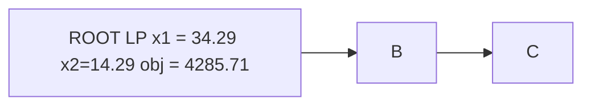

# MIP KATAS

> Собираем и разбираем примеры задач целочисленной оптимизации.

## ROADMAP

- Слабая и сильная задачи(weak and strong formulation)
- python, OOP, SOLID
- архитектура моделей
- PYOMO and SOLVERS
- классические задачи MIP

## Информация для проработки

- https://developers.google.com/optimization/examples
- https://www.gurobi.com/lp/academics/learning-path/
- https://jckantor.github.io/ND-Pyomo-Cookbook/README.html
- https://github.com/Pyomo/PyomoGallery
- column generation
- https://yetanothermathprogrammingconsultant.blogspot.com/2019/02/piecewise-linear-functions-and.html
- http://yetanothermathprogrammingconsultant.blogspot.com/2019/02/piecewise-linear-functions-and_22.html
https://yetanothermathprogrammingconsultant.blogspot.com/2019/03/piecewise-linear-functions-and.html
https://www.ibm.com/docs/ru/icos/20.1.0?topic=expressions-piecewise-linear-functions
- shortest path as lp
- tsp
- tsp lazy for subtour elim
- tsp MTZ
- tsp MTZ tight
- VRP
- https://scipopt.org/doc/html/EXAMPLES.php
- goal programming

